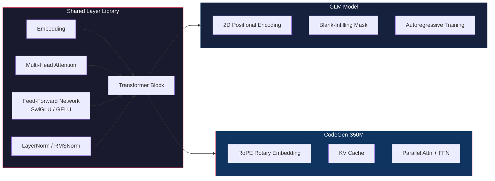
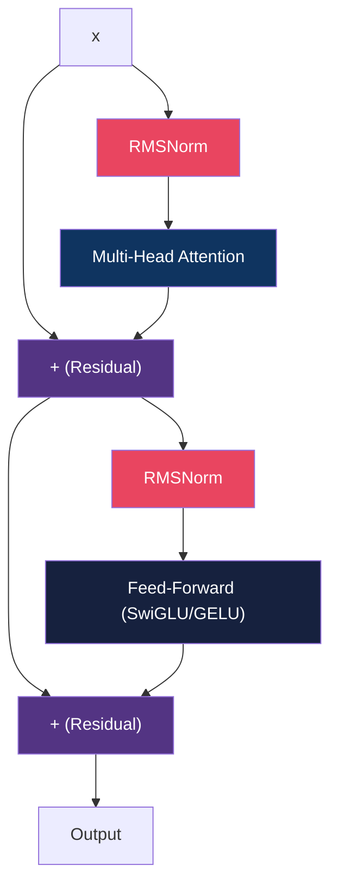
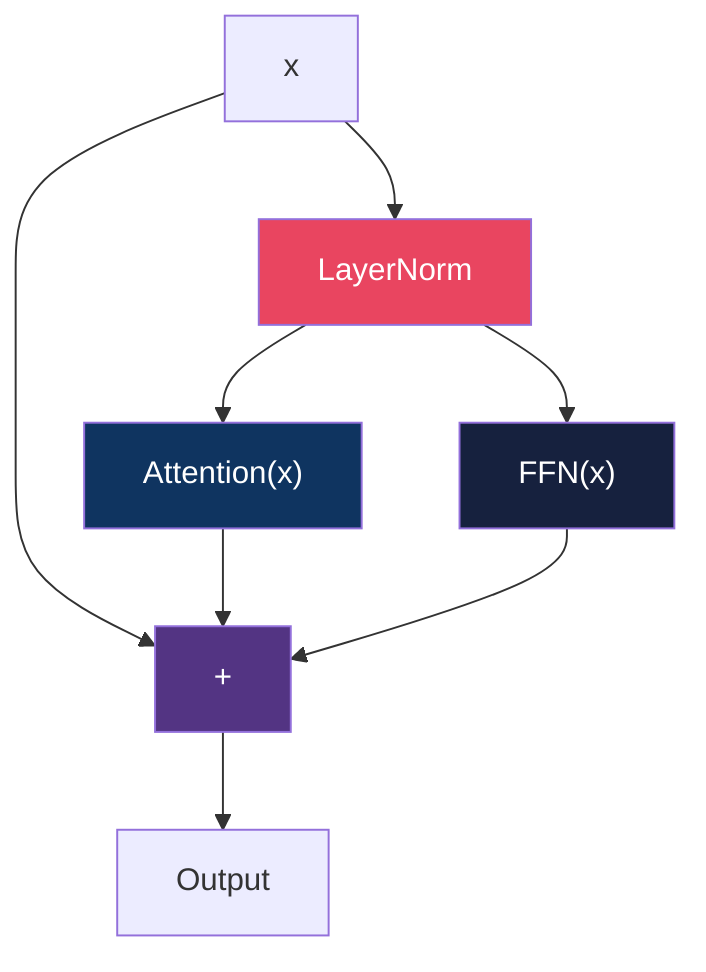
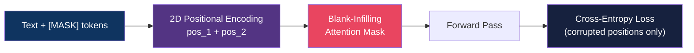
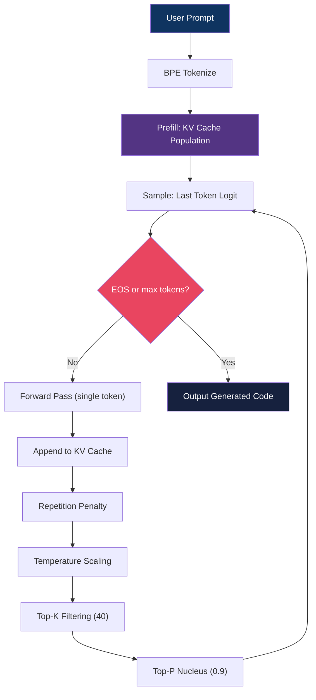
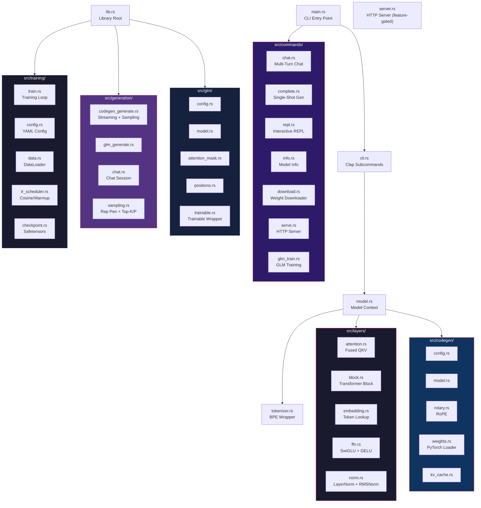

<div align="center">

# 🧠 Transformer in Rust

### From-scratch transformer architectures powered by [Candle](https://github.com/huggingface/candle)

**GLM** (blank-infilling) · **CodeGen-350M** (causal code generation) · CPU-only inference

[](https://www.rust-lang.org/)
[](https://github.com/huggingface/candle)
[](LICENSE)
[]()
[](.github/workflows/ci.yml)

<br>

*No GPU required. No Python runtime. Pure Rust tensor ops — 350M params, 20 ms/token on a laptop CPU.*

</div>

---

## 📋 Overview

Two transformer models share a hand-written layer library built with raw tensor operations:

| Model | Architecture | Params | Use Case |
|:------|:-------------|:------:|:---------|
| **GLM** | Blank-infilling | ~14M | Training playground / demo |
| **CodeGen-350M** | Causal decoder-only | 350M | Real code generation with pretrained weights |



---

## 🏗️ Architecture

### Transformer Block (Pre-Norm)



### CodeGen: Parallel Sub-Block Design



> Both attention and FFN operate on the **same normalized input** — outputs sum with residual in one step (GPT-J style).

### GLM: Blank-Infilling Flow



---

## 🚀 CodeGen Inference Pipeline



---

## ⚡ Performance

`cargo bench` drives the library directly. The benchmark model is a stand-in for
CodeGen-350M — `hidden_dim` 512, 12 layers, 8 heads, vocab 16384 — but keeps the real
`max_seq_len` of 2048, because KV-cache cost scales with the cache buffer rather than with
parameter count.

*Apple M1 Pro, release mode:*

| Benchmark | Time |
|:----------|:-----|
| `prefill/32_tokens` | 35.8 ms |
| `prefill/32_tokens_hidden_only` (no vocabulary projection) | 29.8 ms |
| `generator/32_prompt_16_new` (prefill + decode + sampling) | 110.9 ms |
| Decode, per token | ~5.6 ms |
| `weight_load/tiny_h4` | 1.38 ms |
| `prefill_dtype/f32` vs `prefill_dtype/f16` | 41.8 ms vs 29.4 ms |

Reproduce with `cargo bench --bench transformer`, or refresh this table with
`bash scripts/update-readme-benchmarks.sh`.

### CodeGen-350M, real weights

`Salesforce/codegen-350M-multi`, 64 tokens from `def quicksort(arr):`, greedy,
Apple M1 Pro:

| | F32 | F16 |
|:--|--:|--:|
| Generation, 64 tokens | 4.4 s | **1.3 s** |
| Per token | 68.8 ms | **20.3 ms** |
| Wall clock including weight load | 5.0 s | 1.7 s |
| Peak resident memory | 1.63 GB | 1.08 GB |

Reproduce with:

```bash
cargo run --release -- download
cargo run --release -- --f16 complete "def quicksort(arr):" --max-tokens 64 --temperature 0.0 --no-stream
```

> ⚠️ Debug builds are ~20× slower. Always use `--release`.

---

## 📁 Project Structure



---

## 🛠️ Quick Start

### Prerequisites

- Rust 2021 edition
- CodeGen-350M weights (797MB) — or use `download` command

### Download Weights

```bash
# Option 1: Use the built-in download command
cargo run --release -- download

# Option 2: Manual download
hf download Salesforce/codegen-350M-multi --local-dir codegen_weights
```

### Build & Run

```bash
# Build in release mode (important — debug is 20x slower)
cargo build --release

# Conversational code generation (multi-turn)
cargo run --release -- chat

# Single-shot code generation
cargo run --release -- complete "def fibonacci(n):"

# Interactive REPL
cargo run --release -- repl

# Model info and weight status
cargo run --release -- info

# HTTP inference server (requires --features server)
cargo run --release --features server -- serve --port 8080

# GLM training demo
cargo run --release -- glm-train --data-path data --steps 500
```

### Global Flags

| Flag | Description |
|:-----|:------------|
| `--f16` | Use FP16 precision (faster, less memory) |
| `--weights-dir DIR` | Path to weights directory (default: `codegen_weights`) |
| `--seed N` | Fixed sampling seed for reproducible output |

### Subcommand Reference

| Command | Description | Options |
|:--------|:------------|:--------|
| `chat` | Multi-turn conversational code generation | `--system <prompt>` |
| `complete <prompt>` | Single-shot code generation | `--max-tokens`, `--temperature`, `--template`, `--no-stream` |
| `repl` | Interactive REPL (single-turn) | — |
| `info` | Print model info and weight status | — |
| `download` | Download CodeGen-350M weights from HuggingFace | — |
| `serve` | Start HTTP inference server | `--port <PORT>` (default: 3000) |
| `glm-train` | Train GLM on .py files from scratch | `--data-path`, `--steps` |

### Prompt Templates

The `complete` command supports three prompt templates:

| Template | Description |
|:---------|:------------|
| `completion` | Raw prompt (default) |
| `instruct` | Wraps prompt in instruction format |
| `chat` | Wraps prompt in chat format |

---

## 🌐 HTTP Server

Build with the `server` feature and start an axum-based inference server:

```bash
cargo run --release --features server -- serve --port 8080
```

### Endpoints

| Method | Path | Description |
|:-------|:-----|:------------|
| `GET` | `/health` | Health check |
| `POST` | `/generate` | Generate code from prompt |

### Example Request

```bash
curl -X POST http://localhost:8080/generate \
  -H "Content-Type: application/json" \
  -d '{"prompt": "def fibonacci(n):", "max_tokens": 64, "temperature": 0.6}'
```

---

## ⚖️ Precision

### FP16 Inference

Full dtype propagation through all layers, including blank-initialised models.
On real CodeGen-350M weights it is **3.4× faster** than F32 (20.3 ms/token against
68.8 ms) and uses a third less memory:

```bash
cargo run --release -- --f16 chat
cargo run --release -- --f16 complete "def fibonacci(n):"
```

---

## 🏋️ Training Pipeline

The GLM model supports training from scratch with a production-grade pipeline:

### Configuration

```yaml
# configs/train.yaml — every field is optional and falls back to its default
model:
  vocab_size: 51200
  hidden_dim: 256
  num_layers: 6
  num_heads: 8
  ffn_dim: 1024
  max_seq_len: 512

training:
  learning_rate: 1e-4
  max_grad_norm: 1.0
  micro_batch_size: 1              # sequences per forward pass
  gradient_accumulation_steps: 32  # forward passes per optimizer step
  max_steps: 10000
```

### Features

- **YAML config** — Declarative training configuration via `--config`
- **DataLoader** — Train/eval split, shuffling, random windowing
- **LR Scheduler** — Cosine decay with linear warmup
- **Safetensors Checkpoints** — Save/load weights, step counter and LR schedule
- **Gradient Accumulation** — Configurable accumulation steps
- **Gradient Clipping** — By global norm
- **Evaluation Loop** — Periodic validation with fixed seed

### Quick Start

```bash
# defaults
cargo run --release -- glm-train --data-path data --steps 500

# or drive it from a YAML config
cargo run --release -- glm-train --config configs/train.yaml --steps 500

# continue an earlier run
cargo run --release -- glm-train --config configs/train.yaml --steps 1000 --resume
```

Resume is opt-in. Without `--resume` an existing checkpoint directory is left alone and
training starts from step 0. `--resume` restores the weights, the step counter and the
learning-rate schedule position — but not AdamW's moments, which candle keeps private, so
the loss rises briefly on the first steps after a resume.

---

## 🧩 Model Configurations

### GLM (Tiny)

| Parameter | Value |
|:----------|:------|
| hidden_dim | 256 |
| num_layers | 6 |
| num_heads | 8 |
| ffn_dim | 1024 |
| vocab_size | 16,384 |
| ~params | ~14M |

### CodeGen-350M

| Parameter | Value |
|:----------|:------|
| hidden_dim | 1024 |
| num_layers | 20 |
| num_heads | 16 |
| ffn_dim | 4096 |
| rotary_dim | 32 |
| vocab_size | 51,200 |
| ~params | ~350M |

---

## 🔧 Key Features

- **[RoPE](https://arxiv.org/abs/2104.09864)** — Rotary Position Embedding with even-odd pair rotation
- **[KV Cache](https://arxiv.org/abs/1901.02860)** — Autoregressive generation without recomputation
- **SwiGLU** — Gated feed-forward for GLM
- **Parallel Sub-Blocks** — GPT-J style attn + FFN in parallel
- **Blank-Infilling** — Bidirectional context with causal within-blank masking
- **Sampling Pipeline** — Repetition penalty → temperature → top-k → top-p → random sample
- **Zero-Init Loading** — Avoids allocating 350M random floats before overwriting with weights
- **FP16 Inference** — Full dtype propagation through every layer
- **Token Streaming** — Stream tokens as they're generated
- **Prompt Templates** — Completion, instruct, and chat templates
- **Multi-Turn Chat** — Conversational code generation with history
- **HTTP Server** — axum-based REST API (feature-gated)
- **Training Pipeline** — YAML config, checkpoints, LR scheduler, gradient clipping
- **Safetensors** — GLM save/load, PyTorch .bin converter

---

## 📦 Dependencies

| Crate | Version | Purpose |
|:------|:-------:|:--------|
| [candle-core](https://crates.io/crates/candle-core) | 0.8 | Tensor ops, CPU backend, pickle loader |
| [candle-nn](https://crates.io/crates/candle-nn) | 0.8 | Softmax, cross-entropy |
| [tokenizers](https://crates.io/crates/tokenizers) | 0.21 | HuggingFace BPE tokenizer |
| [clap](https://crates.io/crates/clap) | 4.0 | CLI argument parsing |
| [serde](https://crates.io/crates/serde) | 1.0 | Serialization/deserialization |
| [serde_json](https://crates.io/crates/serde_json) | 1.0 | JSON config parsing |
| [serde_yaml](https://crates.io/crates/serde_yaml) | 0.9 | YAML training config |
| [anyhow](https://crates.io/crates/anyhow) | 1.0 | Error handling |
| [safetensors](https://crates.io/crates/safetensors) | 0.4 | Model serialization |
| [half](https://crates.io/crates/half) | 2.7 | FP16 support |
| [rand](https://crates.io/crates/rand) | 0.8 | Random sampling |
| [ureq](https://crates.io/crates/ureq) | 3.0 | HTTP client (weight download) |
| [axum](https://crates.io/crates/axum) | 0.8 | HTTP server (optional) |
| [tokio](https://crates.io/crates/tokio) | 1.0 | Async runtime (optional) |

---

## 🧪 Testing

```bash
cargo test
```

**69 tests** covering:

| Module | Tests |
|:-------|:------|
| Embedding | Lookup correctness |
| Attention | Causal mask shape + triangularity |
| Block | Transformer block forward (no mask, with mask, SwiGLU, different sizes) |
| FFN | GELU forward, SwiGLU gate |
| Norm | LayerNorm, RMSNorm forward |
| GLM Config | Defaults, param count estimate, clone |
| GLM Positions | 2D positional encoding (context, blanks, shape consistency) |
| GLM Model | Causal forward, blank-infill forward, training loss, attention mask, safetensors save/load |
| CodeGen Config | Defaults, head_dim, HF config parsing |
| CodeGen KV Cache | New, append, reset, dtype support |
| CodeGen Model | Blank-forward, RoPE no-segfault |
| Sampling | Argmax, temperature-zero |
| Training Config | Defaults, YAML serialization, GLM config conversion |
| Training Data | DataLoader, batch, truncation, split, reset |
| Training | LR scheduler (cosine/linear/constant) |
| Chat | Multi-turn session, system prompt, history formatting, clear |
| GLM Generate | Generator new, causal generation, blank-infilling |

---

## 📜 License

MIT

---

<div align="center">

**Built with ❤️ in Rust**

*No Python. No GPU. Just tensors.*

</div>
