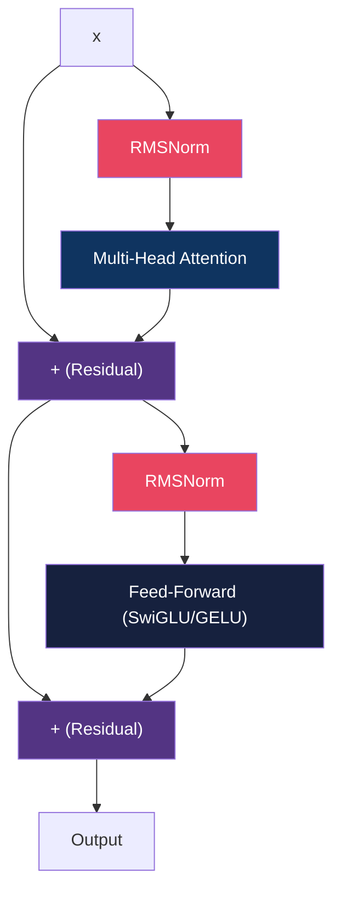
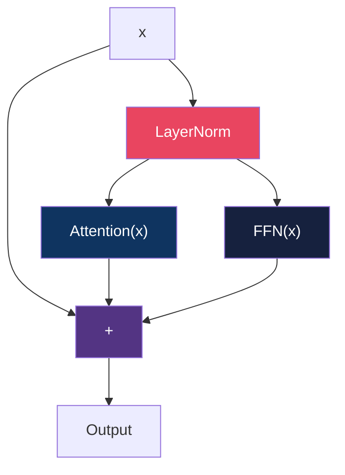
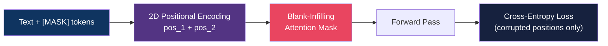
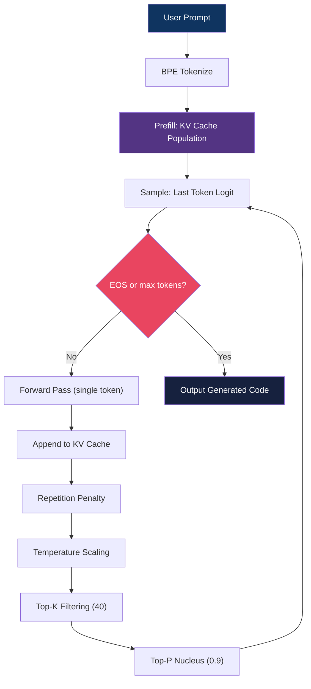
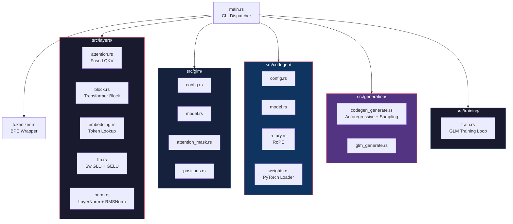

<div align="center">

# 🧠 Transformer in Rust

### From-scratch transformer architectures powered by [Candle](https://github.com/huggingface/candle)

**GLM** (blank-infilling) · **CodeGen-350M** (causal code generation) · CPU-only inference

[](https://www.rust-lang.org/)
[](https://github.com/huggingface/candle)
[](LICENSE)
[]()

<br>

*No GPU required. No Python runtime. Pure Rust tensor ops — 350M params on an i5-6600.*

</div>

---

## 📋 Overview

Two transformer models share a hand-written layer library built with raw tensor operations:

| Model | Architecture | Params | Use Case |
|:------|:-------------|:------:|:---------|
| **GLM** | Blank-infilling | ~14M | Training playground / demo |
| **CodeGen-350M** | Causal decoder-only | 350M | Real code generation with pretrained weights |

<br>


---

## 🏗️ Architecture

### Transformer Block (Pre-Norm)



### CodeGen: Parallel Sub-Block Design



> Both attention and FFN operate on the **same normalized input** — outputs sum with residual in one step (GPT-J style).

### GLM: Blank-Infilling Flow



---

## 🚀 CodeGen Inference Pipeline



---

## ⚡ Performance

*Benchmarked on i5-6600 (4C/4T, 7.5GB RAM) — release mode*

| Operation | Time |
|:----------|:-----|
| Weight loading (350M) | ~0.5s |
| Prefill (7 tokens) | ~0.3s |
| Autoregressive step | ~0.1s/token |
| 37-token generation | ~3.2s |
| GLM training step | ~0.02s |

> ⚠️ Debug builds are ~20× slower.

---

## 📁 Project Structure



---

## 🛠️ Quick Start

### Prerequisites

- Rust 2021 edition
- CodeGen-350M weights (797MB)

### Download Weights

```bash
hf download Salesforce/codegen-350M-multi --local-dir codegen_weights
```

### Build & Run

```bash
# Build in release mode (important — debug is 20x slower)
cargo build --release

# Conversational code generation (multi-turn)
cargo run --release -- chat

# Single-shot code generation
cargo run --release -- complete "def fibonacci(n):"

# Interactive REPL
cargo run --release -- repl

# Model info and weight status
cargo run --release -- info

# Download CodeGen-350M weights
cargo run --release -- download

# HTTP inference server
cargo run --release --features server -- serve --port 8080

# GLM training demo
cargo run --release -- glm-train --data-path data --steps 500

# Global flags
#   --f16              Use FP16 precision
#   --weights-dir DIR  Path to weights (default: codegen_weights)
```

---

## 🧩 Model Configurations

### GLM (Tiny)

| Parameter | Value |
|:----------|:------|
| hidden_dim | 256 |
| num_layers | 6 |
| num_heads | 8 |
| ffn_dim | 1024 |
| vocab_size | 16,384 |
| ~params | ~14M |

### CodeGen-350M

| Parameter | Value |
|:----------|:------|
| hidden_dim | 1024 |
| num_layers | 20 |
| num_heads | 16 |
| ffn_dim | 4096 |
| rotary_dim | 32 |
| vocab_size | 51,200 |
| ~params | ~350M |

---

## 🔧 Key Features

- **[RoPE](https://arxiv.org/abs/2104.09864)** — Rotary Position Embedding with even-odd pair rotation
- **[KV Cache](https://arxiv.org/abs/1901.02860)** — Autoregressive generation without recomputation
- **SwiGLU** — Gated feed-forward for GLM
- **Parallel Sub-Blocks** — GPT-J style attn + FFN in parallel
- **Blank-Infilling** — Bidirectional context with causal within-blank masking
- **Sampling Pipeline** — Repetition penalty → temperature → top-k → top-p → random sample
- **Zero-Init Loading** — Avoids allocating 350M random floats before overwriting with weights

---

## 📦 Dependencies

| Crate | Version | Purpose |
|:------|:-------:|:--------|
| [candle-core](https://crates.io/crates/candle-core) | 0.8 | Tensor ops, CPU backend, pickle loader |
| [candle-nn](https://crates.io/crates/candle-nn) | 0.8 | Softmax, cross-entropy |
| [tokenizers](https://crates.io/crates/tokenizers) | 0.21 | HuggingFace BPE tokenizer |
| [anyhow](https://crates.io/crates/anyhow) | 1.0 | Error handling |
| [serde_json](https://crates.io/crates/serde_json) | 1.0 | Config parsing |

---

## 🧪 Testing

```bash
cargo test
```

**20 tests** covering:

| Module | Tests |
|:-------|:------|
| Embedding | Lookup correctness |
| Attention | Causal mask shape + triangularity |
| FFN | GELU forward, SwiGLU gate |
| Norm | LayerNorm, RMSNorm forward |
| GLM | Causal forward, blank-infill forward, training loss, attention mask, safetensors save/load |
| CodeGen | Blank-forward, RoPE no-segfault |
| Quantized | INT8 quantized linear roundtrip, ranking preservation |
| Sampling | Argmax, temperature-zero |
| Training | LR scheduler (cosine/linear/constant) |

---

## 📜 License

MIT

---

<div align="center">

**Built with ❤️ in Rust**

*No Python. No GPU. Just tensors.*

</div>
